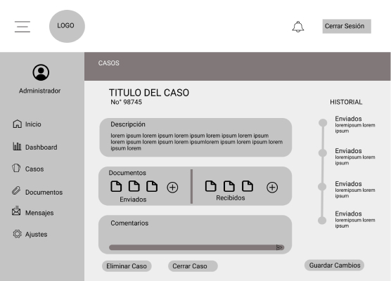

# **LaunchX-Primera practica**

## **Overview**

Cuando se enfrentan a un problema, quieren resolver este problema, pero no saben a quién preguntar y se sienten confundidos, quieren leer artículos de acuerdo con su nivel, quieren un profesional que pueda orientarlos y guiarlos en lo que pueden hacer. La gente exige servicios de forma inmediata y con los mejores estándares de calidad. En el ámbito legal no solo es difícil encontrar asesores y representantes de confianza, sino también gestionar el tiempo para una reunión con un abogado cuando es necesario. Debido al alto coste y a la falta de conocimiento evitan acudir a una asesoría.

## **Planteamiento del Problema**

Un despacho de abogados que quiere automatizar las demandas de sus clientes, esto lo harán a través de una página web llenando un formulario. Al momento de llenar el formulario se manda al proceso de pago para finalizar la transacción. Para dar seguimiento a su demanda, el cliente crea una cuenta en la plataforma y verá el seguimiento de cada una de las actualizaciones del proceso legal. El administrador del sitio recibe la notificación de una nueva demanda y con los datos llenados del formulario se crea automáticamente el documento legal en formato word para empezar el proceso. El administrador recibe el pago y debe de ser capaz de verlo en un dashboard para ver la cantidad de ingresos recibidos. El administrador actualiza el proceso de la demanda y agrega comentarios en cada paso del proceso. Al usuario le llegan correos de notificación para saber el avance de su proceso. La página debe de ser responsive para poderla ver desde el celular. La preferencia de colores del cliente es azul marino y blanco, pero acepta propuestas.

## **Posible solución**

Una solución digital que reúna todas las solicitudes de servicio del despacho legal, así como un seguimiento y organización de cada caso en una sola plataforma. Permitirá generar al cliente una demanda de manera simple, rápida y remota, misma que el administrador de la plataforma recibirá para generar los trámites correspondientes. El usuario tendrá que generar una cuenta nueva en la plataforma una única vez, la cual le permitirá administrar sus datos personales y métodos de pago. De igual forma podrá revisar el avance de sus diferentes procesos legales, ya sea desde la plataforma web o si lo desea mediante notificaciones vía email.

Para el caso del administrador deberá loguearse con la cuenta que les fue asignada, la cual tendrá permisos especiales que le permiten ver solicitudes nuevas, ingresar actualización en demandas anteriores y ver los ingresos recibidos en tiempo real.

### Requerimientos

* Sistema registro en la plataforma
* Formulario autmatizado de generacion de demandas
* Transacciones dentro de la propia plataforma
* Linea del tiempo que muestra el desarrollo de cada caso
* Acceso con permisos especiales para el equipo de abogados
* Dashboard del status financiero
* Panel de modificaciones y actulizaciones de cada caso
* Exportacion de archivos a partir del formulario

## **Proceso de Diseño**

La estrategia de diseño es el marco inicial de un proyecto que aclara ¿qué diseñar? y ¿por qué? antes de abordar cómo diseñarlo. Es la visión de una solución que debe validarse con clientes potenciales reales para demostrar que es deseada en el mercado. Comencé mi proyecto con un enfoque centrado en el usuario, abordando la experiencia del usuario en su totalidad.

## **Fase de Definición**

### Buyer Persona

Un buyer persona es una representación semi-ficticia de tu cliente ideal, elaborada a partir de estudios de mercado y datos reales sobre tus clientes existentes. Los buyer personas proporcionan estructura y contexto a tu empresa. Esto hace que sea más fácil diseñar el contenido, asignar el tiempo y los recursos del equipo y lograr una alineación en toda la organización. Si tienes información sobre el cliente ideal (desafíos, objetivos, datos demográficos, etc.), puedes implementar una estrategia para atraer a los mejores visitantes, leads y clientes para tu empresa.

Santiago Mendoza, Edad 30, Dueño de la concesionaria Mendoza Motors. Santiago es una persona muy activa. Es el primero en llegar a su trabajo y el último en irse. Estudió Contabilidad en la universidad porque siempre tuvo facilidad con las matemáticas y quería manejar las finanzas del negocio de su padre. Al graduarse empezó a trabajar tiempo completo en el negocio de su padre haciendo de esta una de las más exitosas del estado. Al pasar de los años compró la empresa a su padre, convirtiéndose en el único dueño. Tiene un grupo pequeño de amigos con los que les gusta salir a divertirse, pero rara vez encuentra tiempo para hacerlo. No tiene esposa aún, pero planea tenerla en los próximos años.

**Personalidad:** Es una persona muy positiva y alegre. Le gusta tomar el liderazgo y tomar las decisiones. Disfruta de la compañía de sus amigos.

**Metas:** Sueña con convertir a su concesionaria en la primera del estado. Fundar franquicias en todo el país. Invertir en nuevos emprendimientos. Tener una familia.

**Frustraciones:** Que tenga que hacer todo por sí mismo por incompetencia de sus empleados. Tener que lidiar con cuestiones legales. No tener suficiente tiempo para otras actividades. Que ya tiene treinta años y aún no se ha casado.

**Necesidades:** Más tiempo para otras actividades fuera del trabajo. Necesita personas calificadas a su alrededor. Requiere de una familia para sentirse completo.

### Público Objetivo

Tu público objetivo es tu grupo de clientes potenciales. Es el conjunto de personas que podría estar interesada en tu producto o servicio. Encontrar tu público objetivo es un paso fundamental para el marketing eficaz, el desarrollo de productos y la estrategia de negocios general. Los análisis de público objetivo consisten en describir a tu audiencia en términos de una variedad de parámetros demográficos, como la edad y el género, y de otras variables como ingresos, educación y ubicación o psicográficas como intereses y opiniones. Analizar el público objetivo te ofrece información valiosa para la mayoría de las funciones de negocios.
https://miro.com/app/board/uXjVOJnscFs=/?invite_link_id=292050268838

## **Fase de Idea**

### User Flow

Creamos un flujo utilizando Miro para ilustrar cómo el usuario navegará por la aplicación.
https://miro.com/app/board/uXjVOKNZg6o=/?invite_link_id=617942212274

### Clasificación de tarjetas

La clasificación por tarjetas es una técnica que consiste en pedir a los usuarios que organicen la información en grupos lógicos. Tras conocer los requisitos del usuario la clasificación por tarjetas se realiza para tener una idea de qué tipo de características y flujos ayudarían al usuario a alcanzar sus objetivos que ayudarán a organizar la arquitectura de la información.

https://miro.com/app/board/uXjVOKNZg6o=/?invite_link_id=617942212274

### Arquitectura de la información

La arquitectura de la información es una representación visual para los usuarios, de modo que éstos puedan conocer las características y la funcionalidad del producto y puedan encontrar cualquier cosa fácilmente.

https://miro.com/app/board/uXjVOKNZg6o=/?invite_link_id=617942212274

## **Fase de Diseño**

### Low Fidelity Wireframes

### High Fidelity Wireframes

https://www.figma.com/file/03buVInBwyNQoMYHrHE63o/Wireframes?node-id=74%3A45

### Mockups

https://www.figma.com/file/03buVInBwyNQoMYHrHE63o/Wireframes?node-id=0%3A1

